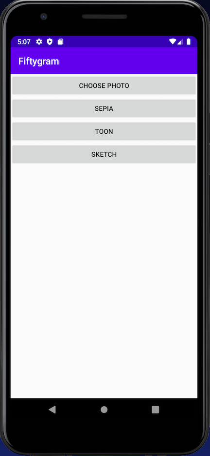

# Android-Fiftygram
One of the many web development projects offered by HarvardX's CS50: Introduction to Computer Science course.

This mobile app development project uses Java and Android Studio to upload images and apply filters onto those images. The examples shown below are examples of the filters applied (Sepia, Toon, and Sketch). Further filters will be applied to give the app more options/flexibility.

This was my second android app and my second attempt at coding in the Java Programming language. I feel I am adapting quite well to developing apps using Java, and am looking forward to developing more Java applications. 

Skills used: Java, Android Studio, Mobile app design (UX/UI Design), credit: [Glide Transformations by wasabeef](https://github.com/wasabeef/glide-transformations)

----------------------------------------------------------------------------------------------------------------

Preview: This is an image of the homepage. Users will be able to choose a photo that they upload via Android's built-in libraries.

 

----------------------------------------------------------------------------------------------------------------

Preview: Once a User uploads an image into the library, they will be able to select an image from their uploads.

 

----------------------------------------------------------------------------------------------------------------

Preview: After selecting an image, the screen changes to have the image as the focus with a list of filter options.

 

----------------------------------------------------------------------------------------------------------------

Preview: Sepia filter applies to a selected image.

 

----------------------------------------------------------------------------------------------------------------

Preview: Toon filter applies to a selected image.

 

----------------------------------------------------------------------------------------------------------------

Preview: Sketch filter applies to a selected image.

 

